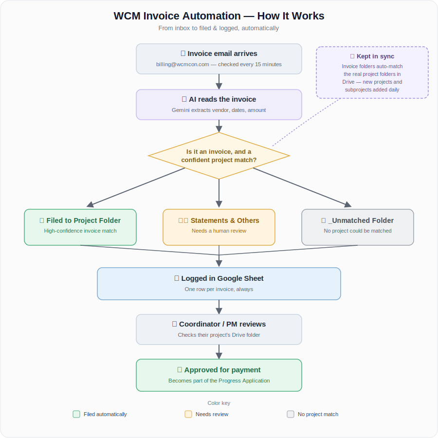

# WCM Billing Automation

Automated invoice filing for WCM: reads invoices from Gmail, extracts data with AI, files the PDF to the right Google Drive project folder, and logs it in a Google Sheet. Runs entirely inside Google Workspace — no external server, no third-party automation platform.

## 👉 New here? Start with the Employee Guide

**[EMPLOYEE_GUIDE.md](./EMPLOYEE_GUIDE.md)** — a plain-language guide to the dashboard: checking invoice status, fixing a misfiled invoice, and sending feedback. No technical background needed.

## How it works

When an invoice arrives at **billing@wcmcon.com**:

1. The system reads the email and its PDF attachment.
2. AI reads the PDF, checks it's actually an invoice (not a statement, receipt, or "update your payment info" email), and pulls out the vendor, dates, and amount.
3. It matches the invoice to the correct WCM project/subproject against the official project list.
4. If it's confident in the match, it automatically files the PDF into that project's **Invoice Archive** folder in Google Drive and logs the details in a Google Sheet.
5. If it's *not* confident — or the document isn't actually an invoice — it still saves a copy (into that project's **Statements & Others** subfolder, or a top-level **_Unmatched** folder if no project matches at all) and flags it for a human to review. Nothing is ever silently misfiled or lost.

A project coordinator/PM gives final human confirmation before sending an invoice to payment — that step is manual and stays outside this automation. No email is ever deleted or altered; the system only reads and copies.

## Documentation

| Doc | For | Covers |
|---|---|---|
| [`EMPLOYEE_GUIDE.md`](./EMPLOYEE_GUIDE.md) | Anyone using the dashboard | Statuses, the edit button, Drive folder layout, feedback, FAQ |
| [`WCM_Invoice_Automation_Plan.md`](./WCM_Invoice_Automation_Plan.md) | Developers / technical maintainers | Architecture, workflow steps, decisions log, feasibility validation, open questions |
| [`apps-script/SETUP.md`](./apps-script/SETUP.md) | Whoever deploys/maintains the live script | Deployment steps, Script Properties, keeping Apps Script in sync with this repo |
| [`apps-script/`](./apps-script/) | Developers | The actual Apps Script source (Gmail, Gemini, Drive, and Sheets services, plus the dashboard) |
| [`project_reference.csv`](./project_reference.csv) | Reference | The full list of WCM construction projects/subprojects used as ground truth for project matching |
| [`site_coordinators_PRIVATE.md`](./site_coordinators_PRIVATE.md) | Reference | Project → coordinator/PM contact list (partial; not yet wired into the automation) |

## Status (as of 2026-07-15)

**Live and running.** Deployed as an Apps Script project bound to the **WCM Invoice Log_Private** Google Sheet. A 15-minute time trigger runs automatically, with `syncProjectReferenceFromDrive()` keeping Invoice Archive folders (project *and* subproject level) in sync daily.

A no-code alternative (Google Workspace Studio / Flows) was evaluated and **ruled out** — it can't dynamically route a file to a different Drive folder per invoice, which is the core requirement here. See the Plan doc's Decisions log for full technical context and history.
