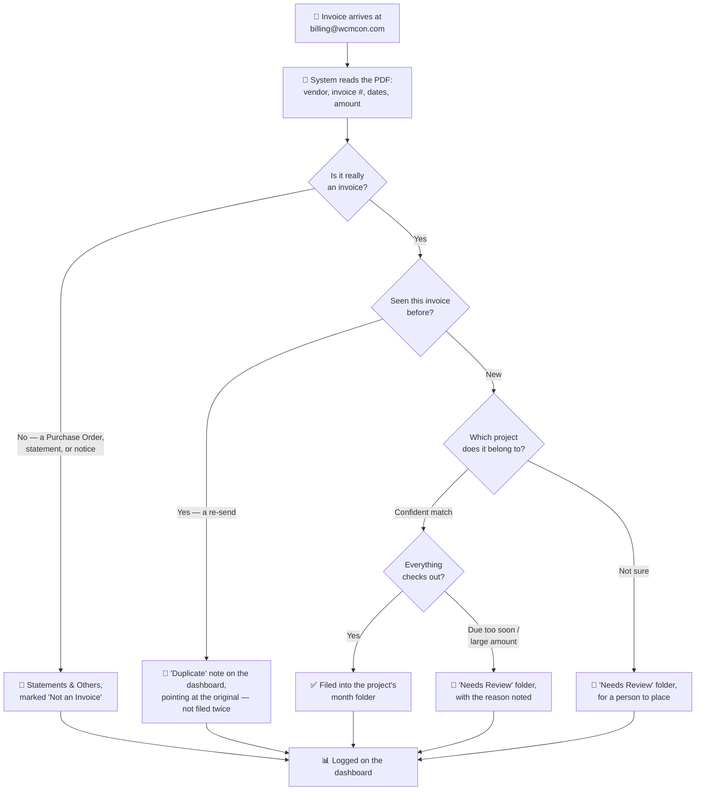

# WCM Invoice Automation

**Every invoice that lands in the billing inbox gets read, sorted to the right project, filed in Drive, and logged — automatically.** No more manually opening each PDF, figuring out which project it belongs to, renaming it, and dragging it into a folder. The system does that the moment an invoice arrives; your team just reviews and approves.

> 📄 **Just want to use it?** Jump to the [**Employee Guide**](./EMPLOYEE_GUIDE.md) for a plain-language walkthrough, or read the [Tutorial](#tutorial-using-the-dashboard) below.

---

## What it does for you

- **Saves the manual sorting.** Invoices arrive at `billing@wcmcon.com` and are filed into the correct project's Drive folder within about 15 minutes — no one has to touch them.
- **Nothing gets lost.** Even when the system isn't sure where something belongs, it still saves a copy and flags it for review. An invoice is never silently dropped.
- **Nothing gets filed twice.** If a vendor re-sends an invoice, the system recognizes it and just notes the re-send — it never creates a second copy.
- **One place to see everything.** A live dashboard shows every invoice, its status, its amount, and where it was filed — no need to dig through Drive or a spreadsheet.
- **Catches what matters.** Non-invoices (POs, statements), tight due dates, duplicates, and anything the system wasn't confident about all get flagged for a person to check before money moves.
- **Learns your corrections.** When you fix a misfiled invoice, the system remembers — the next time that vendor's invoice arrives, it applies what it learned (and still asks you to confirm).
- **You can teach it, right from the dashboard.** Tell it which address or name on an invoice belongs to which project — while fixing an invoice, or in a **Manage hints** panel — so future invoices that only show that address file themselves. No spreadsheet or code access needed.

---

## How it works, step by step

**Step 1 — An invoice arrives.**
Vendors email `billing@wcmcon.com`. Within about 15 minutes, the system picks it up.

**Step 2 — It's read.**
The vendor, invoice number, dates, and amount are pulled from the PDF automatically.

**Step 3 — Real invoices are separated out.**
Purchase Orders, statements, and notices are set aside as **Not an Invoice** — never mixed in with real bills.

**Step 4 — Duplicates are caught.**
A re-sent invoice is never filed twice — the dashboard just notes it as a **Duplicate**.

**Step 5 — It's matched to a project.**
Each invoice is matched to its **project and subproject** — even when the invoice only shows a site address.

**Step 6 — It's filed in Drive** *(see the folder structure below)*.
Renamed to **`YYMMDD - InvoiceNumber - Vendor.pdf`** and placed in exactly one predictable spot.

**Step 7 — It's logged on the dashboard.**
One row per invoice, with its status and links to the filed PDF and the original email.

**Step 8 — People approve.**
Anything uncertain shows as **Needs Review** — fix it on the dashboard and the file moves itself. Payment approval always stays with a person.

---

## The folder structure

Everything lands in the **Invoice Archive**. Each file has exactly one correct home, decided by three questions: *which project? which subproject? what status?*

```
📁 Invoice Archive
│
├── 📁 06 - FOREST EDGE CMNS. - 952 SOUTHDALE        ← one folder per project
│   │
│   ├── 📁 6.4 - Forest Edge Commons (CRU3)          ← one folder per subproject
│   │   └── 📁 2026-07                               ← everything for a month lives inside it
│   │       ├── 📄 260722 - 1163 - Outer Construction.pdf   (Filed / Captured / Paid invoices)
│   │       ├── 📁 Needs Review                      ← invoices waiting on a person
│   │       └── 📁 Statements & Others               ← non-invoices ONLY (POs, statements, notices)
│   │
│   └── 📁 No Subprojects                            ← invoices not tied to any subproject
│       └── 📁 2026-07  (same layout inside)
│
└── 📁 _Unmatched                                    ← couldn't be placed at all — needs a person
```

Three rules make it predictable:

1. **Subproject first.** An invoice lives under its subproject's folder — or under **No Subprojects** when it isn't tied to one.
2. **Statuses never mix.** Everything for a month lives in its `YYYY-MM` folder (the month processed — the same date the filename starts with): real invoices at the month's root, review items in that month's **Needs Review**, and *only* non-invoices in its **Statements & Others**.
3. **Nowhere to hide.** Anything that can't be matched to a project at all goes to the top-level **_Unmatched** folder — visible, never lost.

---

## The whole flow at a glance



---

## Features

**Reading & understanding invoices**
- Reads the PDF from the billing inbox automatically — including invoices whose attachment is mislabeled by the sender.
- Extracts vendor, invoice number, invoice date, due date, amount, and currency (CAD unless the invoice explicitly says USD).
- Tells a real **invoice** apart from a **Purchase Order / Agreement**, an **account statement**, or a payment-info notice — so a PO doesn't get filed as a bill.
- Resolves ambiguous dates (e.g. "09/07/2026") using when the email actually arrived.
- **Duplicate detection** — a re-sent invoice is logged as a *Duplicate* pointing at the original, never filed twice.

**Sorting & filing**
- Matches each invoice to the right project **and** subproject from the official project list — including by **known site addresses**, not just project names.
- Files into the strict structure above: subproject (or *No Subprojects*) → month → invoices at the root, *Needs Review* and *Statements & Others* inside. **Statuses never mix.**
- Standardized, consistent file naming (`YYMMDD - InvoiceNumber - Vendor.pdf`).
- **Vendor name standardization** — one canonical spelling per company, while genuinely different divisions (e.g. *J-AAR Civil* vs *J-AAR Structure*) stay separate.

**Flagging what needs a human**
- **Needs Review** — the system wasn't confident about the match, the amount is unusually large, or the due date lands too soon after arrival (crams the pay period).
- **Duplicate** — the same invoice arrived again.
- **Captured** / **Paid** — set by your team as an invoice moves through the workflow: *Captured* = uploaded to Procore/SmartBuild by the coordinator; *Paid* = confirmed paid.
- Every flag comes with a short plain-language note explaining *why*.

**The dashboard**
- Live status cards with a **time-frame selector** (today / this week / this month / all time).
- **Powerful filters** — pick multiple statuses at once, tick whole projects or individual subprojects, search by vendor or invoice #, filter by amount, and filter any date range by *processed*, *received*, or *invoice* date.
- **Sort control** — reorder the list by any date, vendor, project, amount, or status, ascending or descending.
- **Preview a filed PDF in place**, with its live Drive folder location — and edit the project, subproject, status, invoice #, amount, or currency *right next to the PDF*. **Prev / Next** buttons let you work through a stack without closing the preview.
- **Fix a misfile in one click** — the system moves the actual file in Drive to match (and renames it if you corrected the invoice #). While fixing, an optional box lets you record *what on the invoice identifies the project* — saved as a hint for next time.
- **Manage hints** — a panel to add or remove the name/address → project hints that drive matching, straight from the dashboard (no spreadsheet access).
- **Bulk edit** — select many rows (shift-click selects a range) and re-file them all at once, with a progress bar.
- **Batch download** — select rows and download their PDFs as a single **zip** you name yourself; works even without Google Drive access.
- **Send feedback** straight from the dashboard.
- **Start / Pause** the automation, and swap the dashboard logo — no code needed.

**Keeping itself honest**
- **Vendor memory** — learns from your manual corrections; a previously-corrected vendor's next invoice applies what was learned (and still routes to you to confirm).
- **Override Log** — every correction is recorded (what the system chose vs. what you changed it to), so patterns are visible over time.
- **Daily Drive check** — if someone moves or deletes a filed PDF directly in Drive, the system notices: it updates the log to match (with an audit trail) or flags the row for review. The dashboard and Drive can't silently drift apart.
- The invoice log **archives itself** — old rows roll into an archive tab automatically, so it stays fast for years without a manual reset.
- A running **Errors** log for anything that couldn't be processed.

---

## Tutorial: using the dashboard

You don't need access to the spreadsheet or any code — just the dashboard link (ask whoever manages the automation for the URL, and bookmark it).

**1. Check the day's status.**
The cards across the top show how many invoices are Filed, need review, weren't invoices, or errored. Use the **time-frame selector** (top right) to switch between today / this week / this month.

**2. Find what needs you.**
Open the **Status** dropdown and tick "Needs Review" to see just the invoices waiting on a person. Open the **Project** dropdown and tick your project — ticking a main project includes all its subprojects, or tick just the subprojects you care about. You can also search by vendor or invoice #, filter by amount, and set a date range (by processed, received, or invoice date). The **Sort by** control reorders whatever the filters found.

**3. Look at an invoice.**
Click the **file icon** on a row to preview the PDF right on the page — the panel beside it shows exactly where the file lives in Drive, with an **Open in Drive** button.

**4. Fix one that's filed wrong — without leaving the preview.**
The panel beside the PDF lets you correct the **project, subproject, status, invoice #, amount, or currency**, then **Save changes**. The system moves (and if needed renames) the actual PDF in Drive — and remembers the correction for that vendor. If you're fixing the project, the optional **"What identifies this project?"** box lets you type the address or name printed on the invoice, so the next one matches on its own. Then hit **Next ›** to roll straight to the following invoice.

**5. Fix several at once.**
Tick the **checkboxes** on multiple rows (hold **Shift** to select a range), then **Edit selected** to re-file them all in one go — a progress bar shows it working through the batch.

**6. Teach it a hint (optional).**
If invoices for a project keep arriving under an address the system doesn't recognize, click **Manage hints** in the header, pick the project, and add the name or address. From then on, invoices that mention it file to the right project automatically.

**7. Flag anything odd.**
Use the **Send feedback** button in the corner for anything confusing or wrong — it's tracked for follow-up.

For more detail on each of these, see the [**Employee Guide**](./EMPLOYEE_GUIDE.md).

---

## For the technical team

The main page above is written for everyday users. All technical documentation lives in separate files:

| Document | Covers |
|---|---|
| [`WCM_Invoice_Automation_Plan.md`](./WCM_Invoice_Automation_Plan.md) | Architecture, workflow internals, decisions log, feasibility notes |
| [`apps-script/SETUP.md`](./apps-script/SETUP.md) | Deployment, configuration, keeping the live script in sync with this repo |
| [`apps-script/`](./apps-script/) | The actual source code (Gmail, AI extraction, Drive, Sheets, and the dashboard) |
| [`project_reference.csv`](./project_reference.csv) | The master project/subproject list used for matching |
| [`property_addresses.md`](./property_addresses.md) | Canonical property addresses backing the address-based matching |
| [`EMPLOYEE_GUIDE.md`](./EMPLOYEE_GUIDE.md) | The end-user how-to (also linked above) |

**Status:** Live and running inside Google Workspace — no external server or third-party automation platform. Runs on an automatic schedule; the dashboard is a hosted web page anyone with the link can view.
