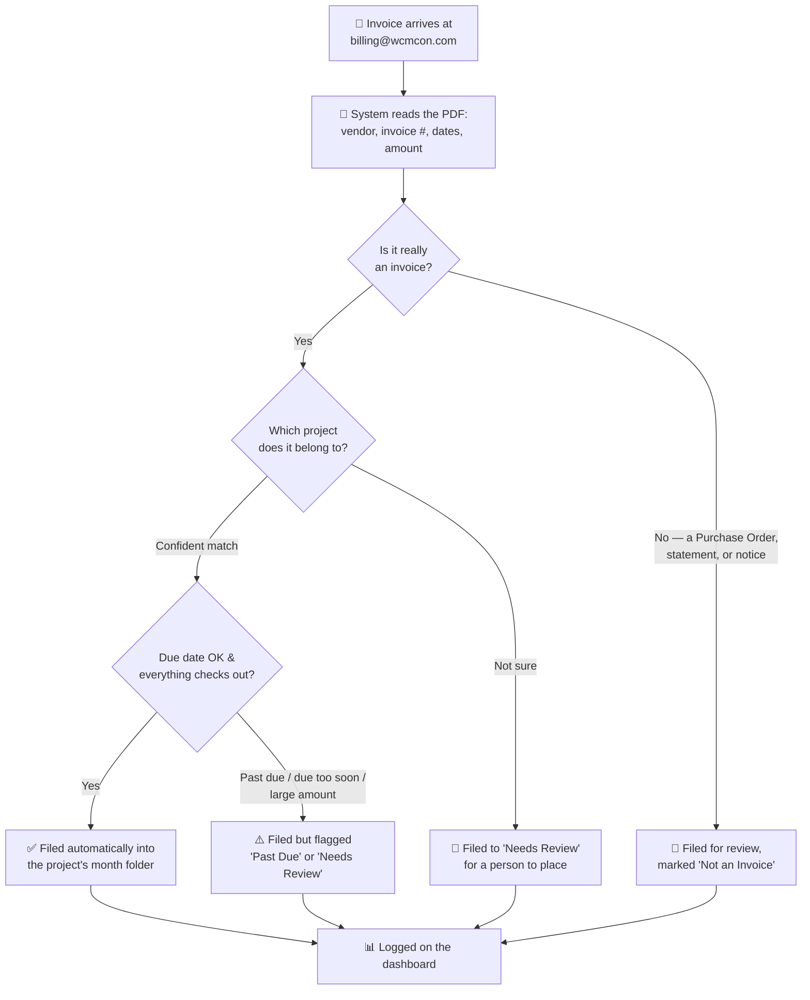
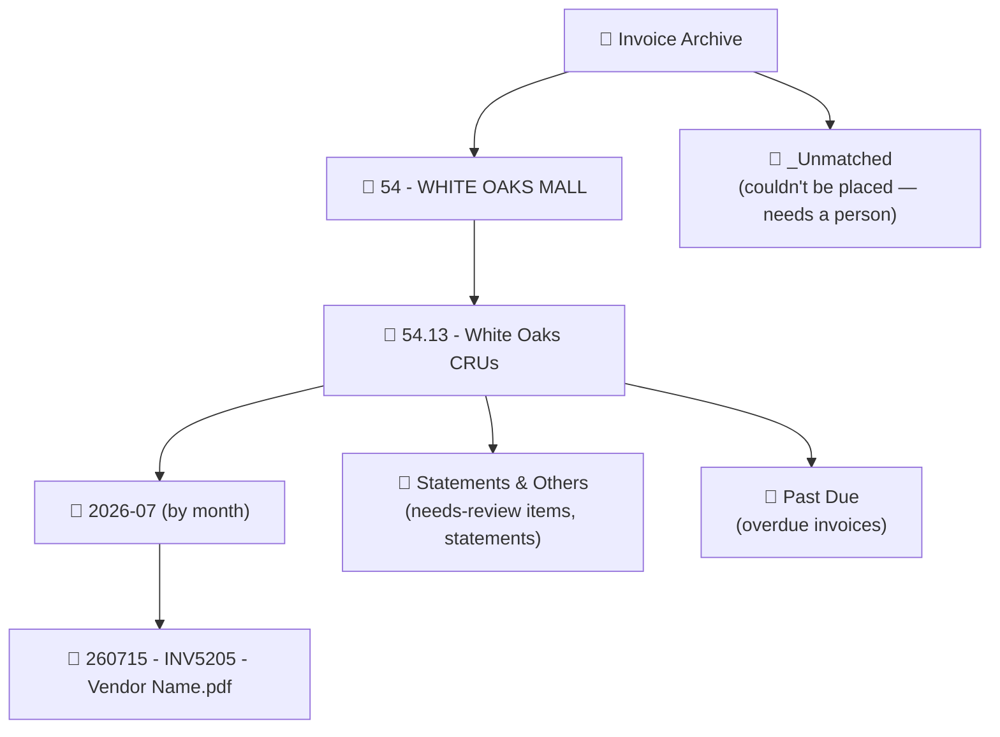

# WCM Invoice Automation

**Every invoice that lands in the billing inbox gets read, sorted to the right project, filed in Drive, and logged — automatically.** No more manually opening each PDF, figuring out which project it belongs to, renaming it, and dragging it into a folder. The system does that the moment an invoice arrives; your team just reviews and approves.

> 📄 **Just want to use it?** Jump to the [**Employee Guide**](./EMPLOYEE_GUIDE.md) for a plain-language walkthrough, or read the [Tutorial](#tutorial-using-the-dashboard) below.

---

## What it does for you

- **Saves the manual sorting.** Invoices arrive at `billing@wcmcon.com` and are filed into the correct project's Drive folder within about 15 minutes — no one has to touch them.
- **Nothing gets lost.** Even when the system isn't sure where something belongs, it still saves a copy and flags it for review. An invoice is never silently dropped.
- **One place to see everything.** A live dashboard shows every invoice, its status, its amount, and where it was filed — no need to dig through Drive or a spreadsheet.
- **Catches what matters.** Past-due bills, invoices that squeeze the pay period, and anything the system wasn't confident about all get flagged for a person to check before money moves.
- **Learns your corrections.** When you fix a misfiled invoice, the system remembers — the next time that vendor's invoice arrives, it applies what it learned (and still asks you to confirm).

---

## How an invoice flows through it

A project coordinator or PM always gives the final human OK before an invoice goes to payment — that approval step stays with people, on purpose. The system only reads and copies; it never deletes or changes the original email.

---

## How invoices are filed in Drive

Everything lands in the **Invoice Archive**, organized so any invoice is easy to find:

- **Confidently-filed invoices** go straight into their project → subproject → month folder.
- **Anything needing a look** goes into that project's **Statements & Others** (or **Past Due**) subfolder — never lost, just one folder deeper awaiting review.
- **Invoices the system couldn't place at all** go to a top-level **_Unmatched** folder so they're easy to spot and assign.
- **Filenames are standardized**: `YYMMDD - InvoiceNumber - Vendor.pdf` (the date is when it was processed).

---

## Features

**Reading & understanding invoices**
- Reads the PDF from the billing inbox automatically — including invoices whose attachment is mislabeled by the sender.
- Extracts vendor, invoice number, invoice date, due date, and amount.
- Tells a real **invoice** apart from a **Purchase Order / Agreement**, an **account statement**, or a payment-info notice — so a PO doesn't get filed as a bill.
- Resolves ambiguous dates (e.g. "09/07/2026") using when the email actually arrived.

**Sorting & filing**
- Matches each invoice to the right project **and** subproject from the official project list.
- Files into a tidy project → subproject → month folder structure in Drive.
- Separate **Past Due** and **Statements & Others** areas for anything needing attention.
- Standardized, consistent file naming.
- **Vendor name standardization** — one canonical spelling per company, so "Copp's Buildall" and "COPPS BUILDALL" don't split into two, while genuinely different divisions (e.g. *J-AAR Civil* vs *J-AAR Structure*) stay separate.

**Flagging what needs a human**
- **Past Due** — the due date has already passed.
- **Crams the pay period** — due date lands too soon after arrival.
- **Needs Review** — the system wasn't confident about the project match.
- Every flag comes with a short plain-language note explaining *why*.

**The dashboard**
- Live status cards (Filed / Needs Review / Not an Invoice / Past Due / Errors) with a **time-frame selector** (today / this week / this month / all time).
- Filter the invoice list by status, project, vendor, date range, or amount.
- **Preview a filed PDF in place** — with its Drive folder location shown — plus an "Open in Drive" button.
- **Fix a misfile** with one click: change the project, subproject, or status and the system moves the actual file in Drive to match.
- **Bulk edit** — select many invoices and re-file them all at once.
- Invoice number and both the received date and processed date shown per row.
- **Send feedback** straight from the dashboard.
- **Start / Pause** the automation, and swap the dashboard logo — no code needed.

**Learning & record-keeping**
- **Vendor memory** — learns from your manual corrections. When a vendor you've corrected before sends another invoice, the system applies what it learned (and routes it to you to confirm, never silently).
- **Override Log** — every correction is recorded (what the system chose vs. what you changed it to), so patterns are visible over time.
- A running **Errors** log for anything that couldn't be processed.

---

## Tutorial: using the dashboard

You don't need access to the spreadsheet or any code — just the dashboard link (ask whoever manages the automation for the URL, and bookmark it).

**1. Check the day's status.**
The cards across the top show how many invoices are Filed, need review, are past due, etc. Use the **time-frame selector** (top right) to switch between today / this week / this month.

**2. Find what needs you.**
Set the **Status** filter to "Needs Review" or "Past Due" to see just the invoices waiting on a person. You can also filter by your project, a vendor, an amount range, or a date range.

**3. Look at an invoice.**
Click the **file icon** on a row to preview the PDF right on the page — it also shows exactly where the file lives in Drive, with an **Open in Drive** button if you want the full folder.

**4. Fix one that's filed wrong.**
Click the **pencil icon** on the row, pick the correct project / subproject / status, and Save. The system moves the actual PDF in Drive to the right folder for you — and remembers the correction for next time.

**5. Fix several at once.**
Tick the **checkboxes** on multiple rows, then use **Edit selected** to re-file them all in one go (e.g. reassign a batch of a vendor's invoices to the right project).

**6. Flag anything odd.**
Use the **Send feedback** button in the corner for anything confusing or wrong — it's tracked for follow-up.

For more detail on each of these, see the [**Employee Guide**](./EMPLOYEE_GUIDE.md).

---

## For the technical team

The main page above is written for everyday users. All technical documentation lives in separate files:

| Document | Covers |
|---|---|
| [`WCM_Invoice_Automation_Plan.md`](./WCM_Invoice_Automation_Plan.md) | Architecture, workflow internals, decisions log, feasibility notes |
| [`apps-script/SETUP.md`](./apps-script/SETUP.md) | Deployment, configuration, keeping the live script in sync with this repo |
| [`apps-script/`](./apps-script/) | The actual source code (Gmail, AI extraction, Drive, Sheets, and the dashboard) |
| [`project_reference.csv`](./project_reference.csv) | The master project/subproject list used for matching |
| [`EMPLOYEE_GUIDE.md`](./EMPLOYEE_GUIDE.md) | The end-user how-to (also linked above) |

**Status:** Live and running inside Google Workspace — no external server or third-party automation platform. Runs on an automatic schedule; the dashboard is a hosted web page anyone with the link can view.
